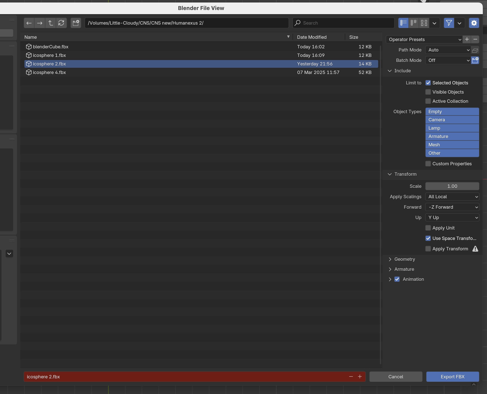

# Humanexus 2.0 notes
last update: 2025-5-27

## Unity instructions
## 1 - import jpgs for textures into TempTextures folder

### A - use Unity menu 'Humanexus-Texture Sets'
Runs entirely from Unity Editor scripts. Manageable if <100 assets are needed and a pruned CSV sheet is available.

#### timing:
- import 10 assets from kidney_10_micro.csv: 37,067ms (37s)
- import 100 assets from kidney_100_micro.csv: 377,992ms (6.3min)
- import 1000 assets from kidney_1000_micro.csv: 3,774,997ms (62.9min)
- imports 1000+ are not practical with this method

(the currect version supports CSV sheets with three columns: graphic, ftu, organ)

### B - use Unity menu 'Humanexus-Manual Import (with manual image import)
This Unity Editor script builds a scene and all needed assets from the image files contained in the TempTextures folder. It assumes that the user manually copies all image files into the TempTextures folder. Could be used for testing with very small sets of images. 

### ==>>C - use Unity menu 'Humanexus-Manual Import (with image import from external Python script)
This requires a Python script (copy_files_by_selector.py).

The script requires the following information: 
*source_folder* - folder containing of a collection of jpg image files to copy from
*destination_folder* - folder into which selected image files will be copied (Unity TempTextures)
*csv_folder* - Python script will look in this folder for the CSV file
*csv_file* - name of the CSV file to be used as lookup (an extended version of "22ftu_micro.....")

the CSV sheet has five columns (in this order): 
*graphic, ftu, organ, species, sex*

"graphic" contains the file name of the image file (ex.: PMC1555595_1471-2202-7-54-2_panel_1.jpg) 
The other four columns can be used to select subsets from the sheet. For this the four filter strings are defined: 
*filter_ftu* = "nephron  
*filter_organ* = "kidney" 
*filter_species* = "human" 
*filter_sex* = "female"

This selection pattern would yield 29,018 images!

(An empty filter string works like a 'joker' for the respective column)

CSV file used for testing: 22ftu_micro_organ_metadata_expanded.csv 
- contains 233,624 lines (unique images)
- 24 unique entries in the "ftu" column
- 10 unique entries in the "organ" column
- 31 unique entries in the "sex" column
- 2,235 unique entries in the "species" column

All unique column entries are listed in these files: 
*content_ftu.csv* 
*content_organ.csv* 
*content_sex.csv* 
*content_species.csv*

#### timing:
- import 10 assets from 22ftu folder to Unity TempTextures 0.0978s
- import 100 assets from 22ftu folder to Unity TempTextures 0.2899s
- import 1000 assets from 22ftu folder to Unity TempTextures  1.7424s
- import 10000 assets from 22ftu folder to Unity TempTextures  15.1904s, Unity indexing: 2-3minutes, ~20min to build scen
- running copy_files_by_selector.py on 22ftu folder, copied 29018 images in 45s!

## 2 - build textured vertex cloud from contents in TempTextures folder
    use menu Humanexus-Cloud Building-Build from Current Set

### 3 - press "Play"
    <spacebar> show/hide icosphere
    <left/right arrow keys> decrease/increase diameter of cloud
    <up/down arrow keys> dolly camera in/out

## Preparations

Vertex clouds are built by attaching a cube GameObject to each vertex of a sphere in Unity. Best results are obtained from "Icospheres" (a geodesic polyhedron constructed from equilateral triangles). Opposite to a UV Sphere, an Icosphere provides an evenly distributed spherical cloud of vertices. The number of vertices is not arbitrary. Dedepending on subdivisions certain amounts of cloud points (coordinates) are produced. We use Icospheres created in and exported from Blender which delivers these point counts:

| Subdivisions | Vertices |
|:------------:|---------:|
| 1            | 12       |
| 2            | 42       |
| 3            | 162      |
| 4            | 642      |
| 5            | 2,562    |
| 6            | 10,242   |
| 7            | 49,602   |
| 8            | 163,842  |

### Blender Export
(from my notes early in the project, may have to update)
Blender set scale to 0.01

### Unity Import

Import into Unity Models

Open import settings on imported object

Uncheck “Convert Units”

Check “Read/Write”

Apply

### Use in Unity Scene

(updates!)

Drag sphere object to Hierarchy and drop over Spheres gameobject.

Scale = 1, pos & rot = 0(??)

Add SphereInfo script. Fill in the Vertex Count field in Inspector with number of vertices in this Icosphere.

## Use Icosphere objects created in Blender.
(An icosphere is a polyhedral sphere made of triangles. It's a geodesic polyhedron, which means it's a convex shape with straight edges and flat faces that approximate a sphere.)

Using Icosphere with 4 subdivisions result in 642 vertices. (Icosphere 5 results in 2562 vertices)

Export .FBX from Blender and import into Unity project. (in Blender export dialog, check "selected" objects", deselect "Apply Unit")

In Unity open import settings on imported object.

Uncheck “Convert Units”.

Check “Read/Write”.

Apply

-->this needs to be updated------------
Put Icosphere object into scene.

Check that Scale = 1, Position & Rotation = 0.

Attach "VerticesExperiment" script.

Populate Icosphere and Ball fields (Ball = sphere of scale 0.1)

Run in Unity. The script will instantiate the object given in the Ball field at each vertex of the Icosphere. This may take a few seconds.

Use up/down arrow keys to enlarge/shrink the diameter of the cloud

Use space key to hide/show Icosphere.
